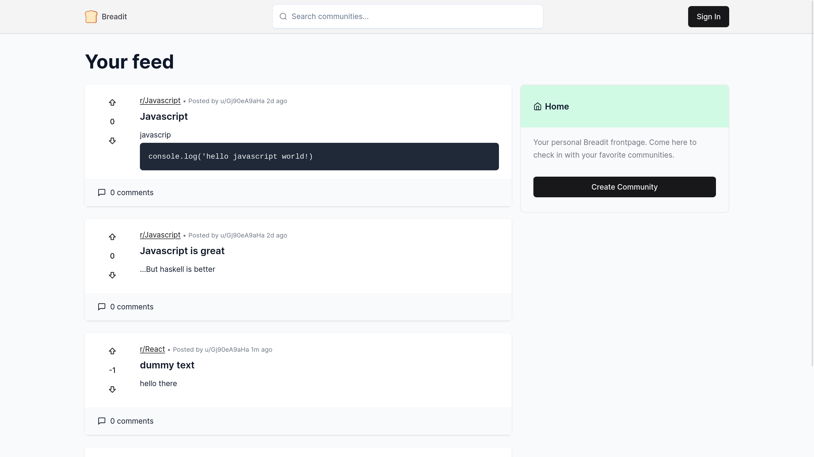

# Breadit - A Modern Fullstack Reddit Clone

### You can check out the live website at: [https://breadit-se39.vercel.app](https://breadit-se39.vercel.app)

Built with the Next.js App Router, TypeScript & Tailwind with the help of a video tutorial made by [Josh tried coding](https://www.youtube.com/@joshtriedcoding)

## Features

- Infinite scrolling for dynamically loading posts
- Authentication using NextAuth & Google
- Custom feed for authenticated users
- Advanced caching using [Upstash Redis](https://upstash.com/?utm_source=Josh2)
- Optimistic updates for a great user experience
- Modern data fetching using React-Query
- A beautiful and highly functional post editor
- Image uploads & link previews
- Full comment functionality with nested replies

## License

[MIT](https://choosealicense.com/licenses/mit/)
